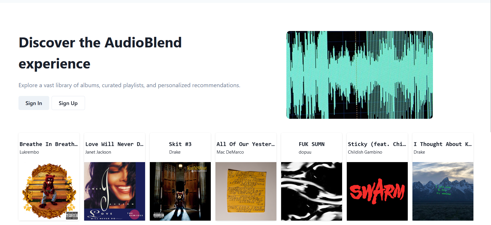
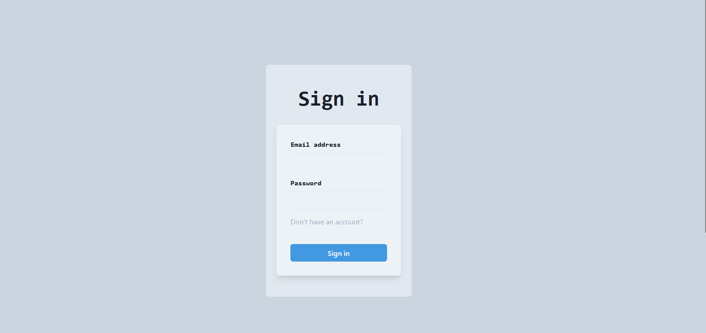
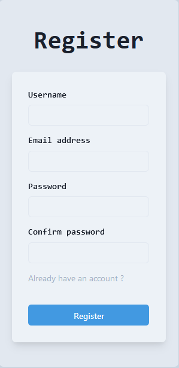
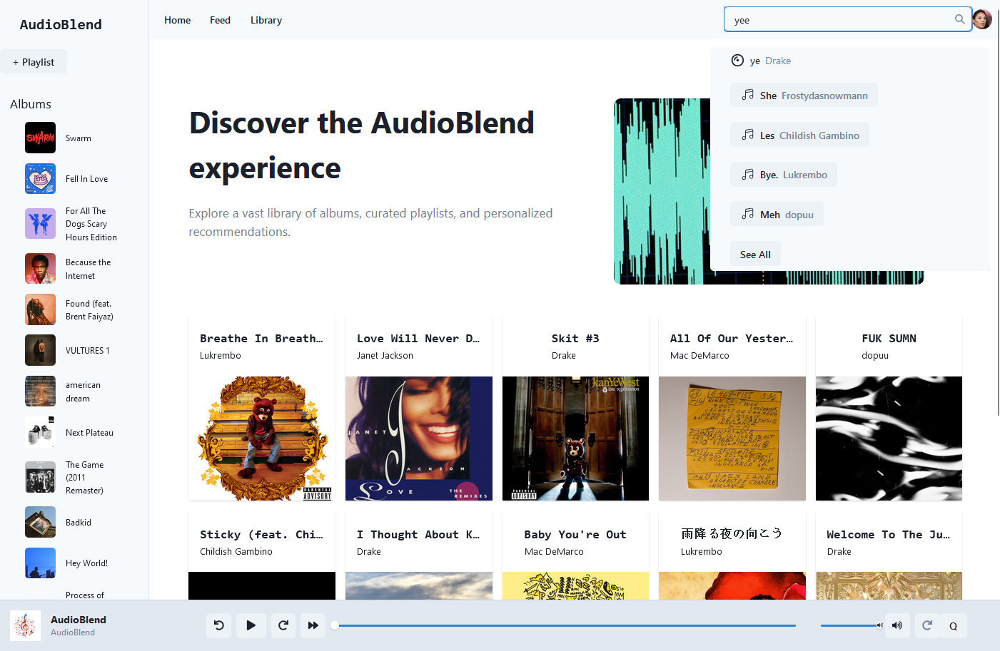
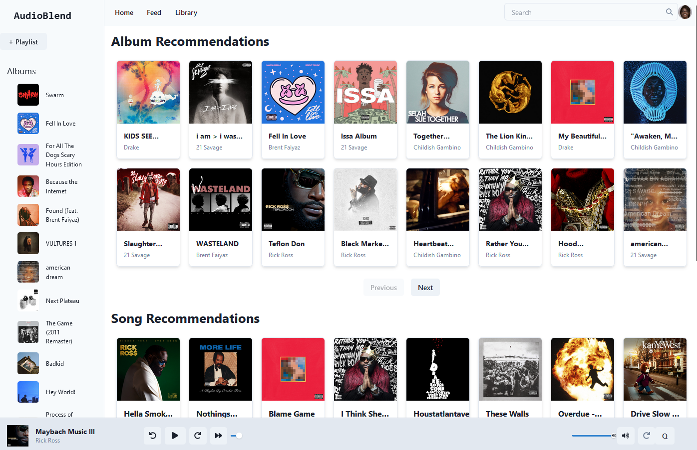
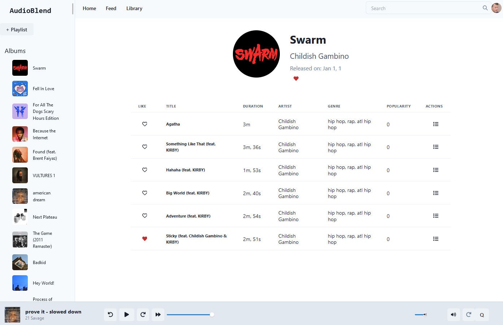
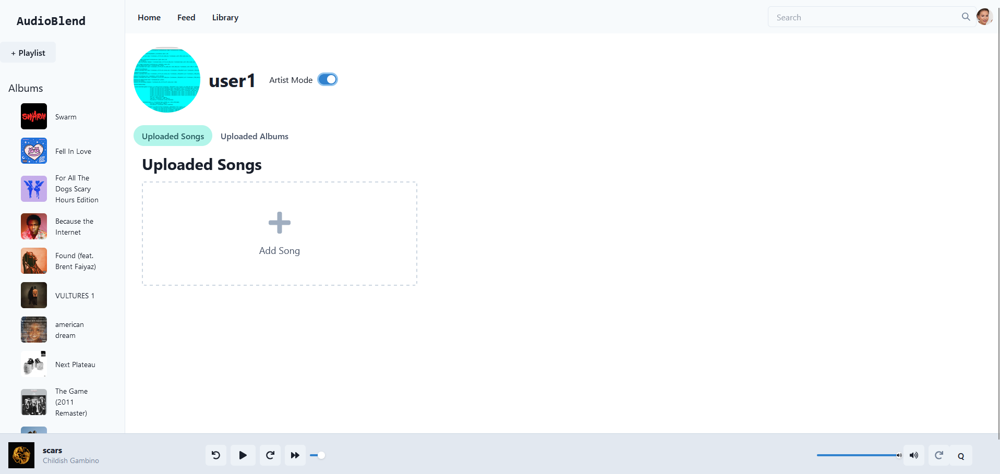
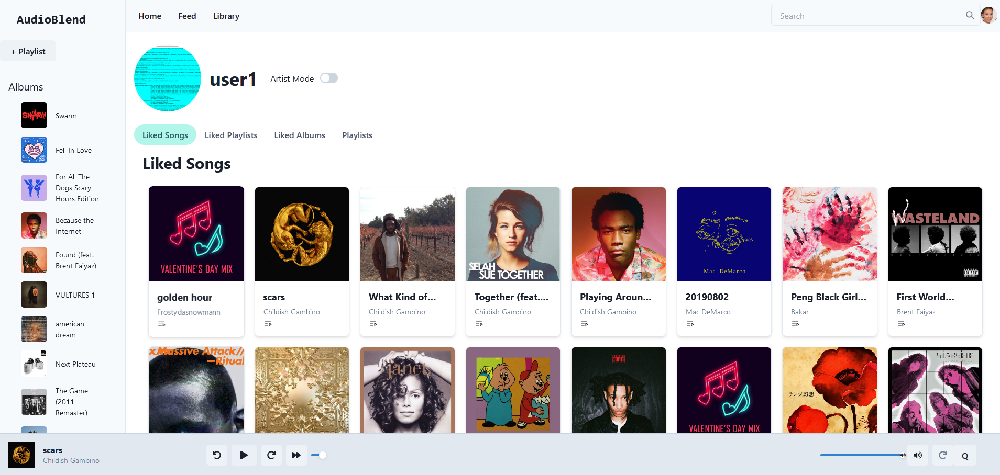
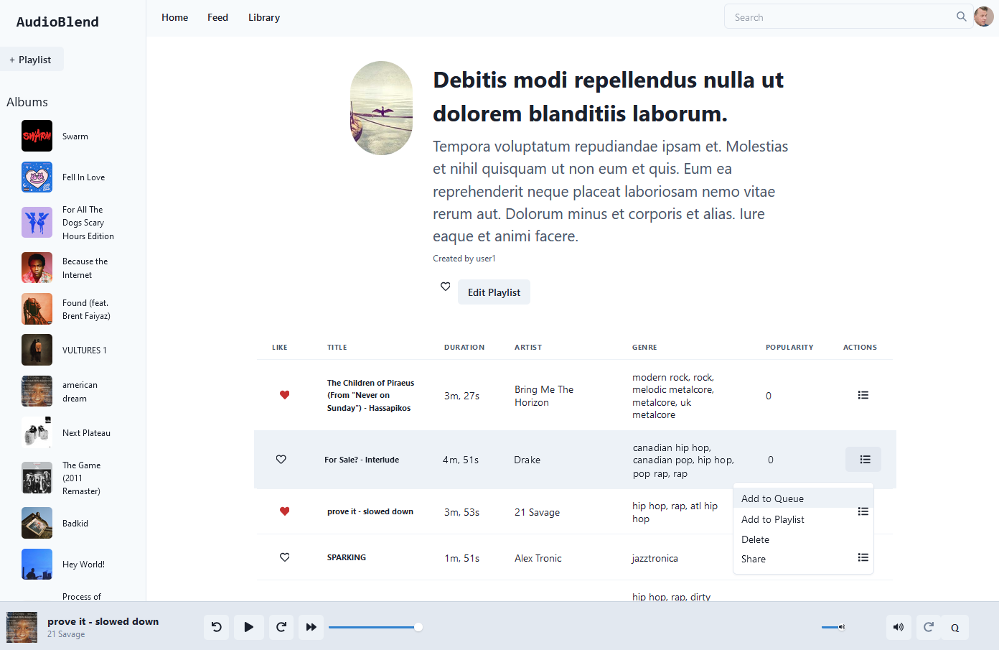
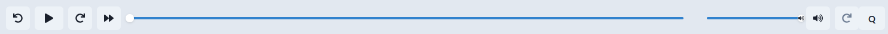

# 🎵 AudioBlend Frontend

A modern music streaming web application built with **React 18 + Vite**, featuring a sleek audio player, artist/album browsing, playlists, user profiles, and a social feed.

---

## 📦 Getting Started

```bash
# Install dependencies
pnpm install

# Run dev server
pnpm dev

# Build for production
pnpm build
```

---

## 📄 Pages & Routes

| Route | Description |
|---|---|
| `/` | Main landing page |
| `/home` | Home feed (authenticated) |
| `/login` | Login page |
| `/register` | Registration page |
| `/albums/:albumid` | Album detail page |
| `/artist/:artistid` | Artist detail page |
| `/playlists/:playlistid` | Playlist detail page |
| `/profile` | Current user profile |
| `/profile/settings` | Profile settings |
| `/search` | Search page |
| `/add-album` | Add a new album (artist) |
| `/add-song` | Add a new song (artist) |
| `/feed` | Social activity feed |

---

## 🖼️ Screenshots

### 🏠 Main Page (Unauthenticated)


---

### 🔐 Login


---

### 📝 Register


---

### 🏠 Main Page (Authenticated)


---

### 🗂️ Application Layout


---

### 💿 Album Page


---

### 🎤 Artist Page


---

### 👤 User Profile


---

### 📋 User Playlists


---

### ▶️ Audio Player


---

## 🗂️ Project Structure

```
audio-blend-frontend/
├── public/               # Static assets & screenshots
├── src/
│   ├── components/       # Reusable UI components (NavBar, AudioPlayer, LibraryPanel, …)
│   ├── pages/            # Route-level page components
│   ├── stores/           # Pullstate global stores (AuthStore, …)
│   ├── utils/            # Helpers (AuthHelper, …)
│   ├── App.jsx           # Root component with routing
│   └── main.jsx          # Entry point
├── index.html
├── vite.config.js
├── tailwind.config.js
└── package.json
```

---

## 🔑 Authentication

Authentication is token-based. The JWT token is stored in `localStorage` and validated on app load via `checkAuth()`. Authenticated routes display the `NavBar`, `LibraryPanel`, and `AudioPlayer` components.
